# Programming Ukrainian Books

  
<h1>C && Cpp</h1>

  

    

    <h3>C Cpp Теорія та практика</h3>
      

    
  

    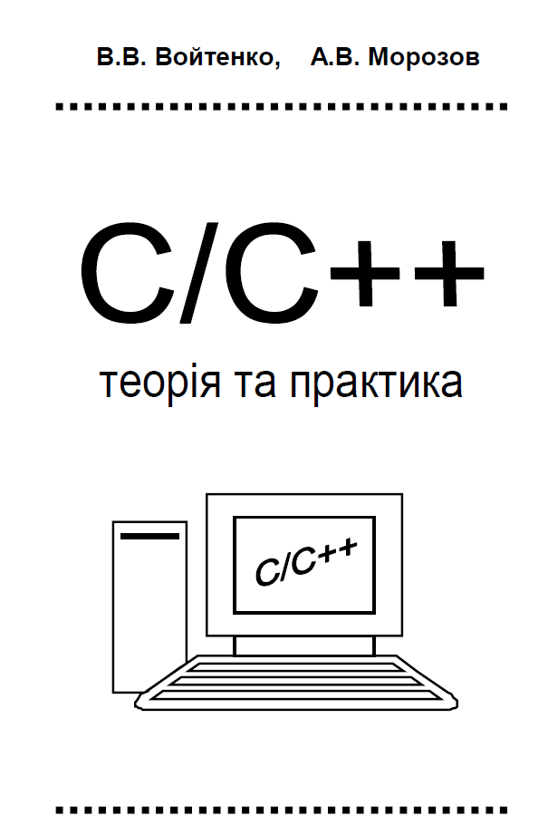
  

  

    <a href="./books/C/C_Cpp_Teoriia_ta_praktyka.pdf">PDF</a>
    <a href="https://www.google.com/url?sa=i&rct=j&q=&esrc=s&source=web&cd=&ved=0CAIQw7AJahcKEwiQ2r3un6f_AhUAAAAAHQAAAAAQBg&url=https%3A%2F%2Fchtyvo.org.ua%2Fauthors%2FVoitenko_Volodymyr%2FC_Cpp_Teoriia_ta_praktyka.pdf&psig=AOvVaw3iUHBQAlwOpH59Wu8EdSbI&ust=1685884660633649">Source</a>
  

       

    

    <h3>Alhorytmizatsiia_ta_prohramuvannia_protsedur_obrobky_informatsii_S</h3>
      

    
  

    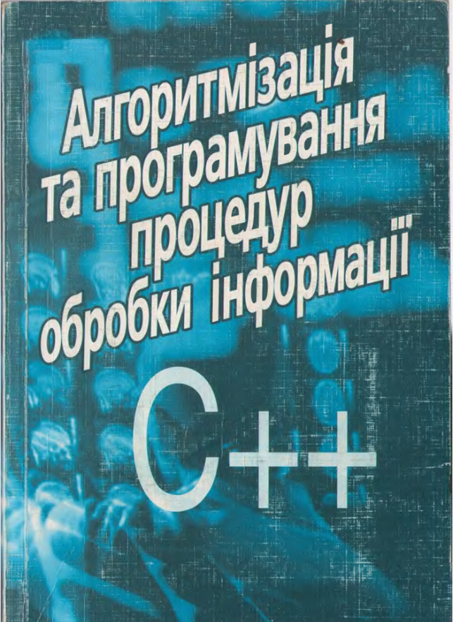
  

  

    <a href="./books/C/Alhorytmizatsiia_ta_prohramuvannia_protsedur_obrobky_informatsii_S.pdf">DJVU</a>
    <a href="https://chtyvo.org.ua/authors/Schedrina_Olena/Alhorytmizatsiia_ta_prohramuvannia_protsedur_obrobky_informatsii_S/">Source</a>
  

       

  
<h1>Java</h1>

	

	
<h3>Java Kid</h3>

		

    		 
  		

  		

    		 <a href="./books/Java/JavaKid_ua">PDF</a>
    		 <a href="http://myflex.org/books/java4kids/java4kids.htm">Source</a>
  		

	

	
<h3>Програмування в Java</h3>

		

    		 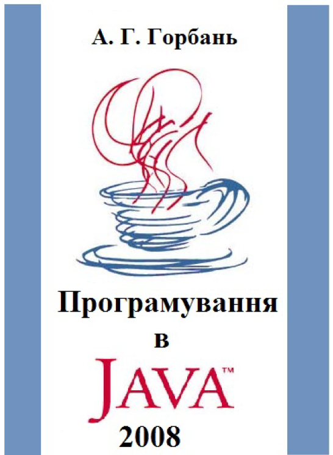
  		

  		

    		 <a href="./books/Java/JAVA_programming_Gorban.pdf">PDF</a>
    		 <a href="https://ukrtechlibrary.wordpress.com/2012/02/24/%d0%b3%d0%be%d1%80%d0%b1%d0%b0%d0%bd%d1%8c-%d0%b0-%d0%b3-%d0%bf%d1%80%d0%be%d0%b3%d1%80%d0%b0%d0%bc%d1%83%d0%b2%d0%b0%d0%bd%d0%bd%d1%8f-%d0%b2-java-2008-pdf/">Source</a>
  		

	
<h3>Освоюємо_Java</h3>

		

    		 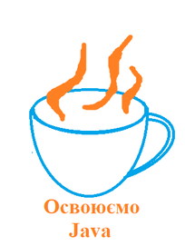
  		

  		

    		 <a href="./books/Java/Освоюємо_Java.pdf">PDF</a>
    		 <a href="https://uk.wikibooks.org/wiki/%D0%9E%D1%81%D0%B2%D0%BE%D1%8E%D1%94%D0%BC%D0%BE_Java">Source</a>
  		

  
<h1>Haskell</h1>

  

    

    <h3>Вивчить собі Хаскела на велике щастя!</h3>
      

    
  

    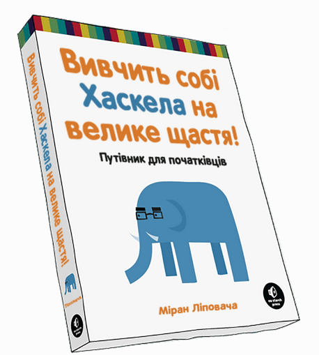
  

  

    <a href="./books/Haskell/luahfgg.pdf">PDF</a>
    <a href="https://haskell.trygub.com/">Source</a>
  

       

  
<h1>Lisp</h1>

    

    <h3>Мова функціонального програмування Лiсп</h3>
      

    
  

    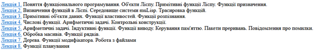
  

  

    <a href="./books/Lisp">PDF</a>
    <a href="http://www.unicyb.kiev.ua/Library/Lisp/LISP.HTM">Source</a>
  

       

    

    <h3>Common_Lisp</h3>
      

    
  

    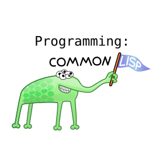
  

  

    <a href="./books/Lisp/Another/Common_Lisp.pdf">PDF</a>
    <a href="https://uk.wikibooks.org/wiki/Common_Lisp">Source</a>
  

       

  
<h1>Python</h1>

  

    

    <h3>Підручник_мови_Python</h3>
      

    
  

    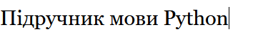
  

  

    <a href="./books/Python/Підручник_мови_Python.pdf">PDF</a>
    <a href="https://uk.wikibooks.org/wiki/%D0%9F%D1%96%D0%B4%D1%80%D1%83%D1%87%D0%BD%D0%B8%D0%BA_%D0%BC%D0%BE%D0%B2%D0%B8_Python">Source</a>
  

       

    

    <h3>Пориньте_у_Python_3</h3>
      

    
  

    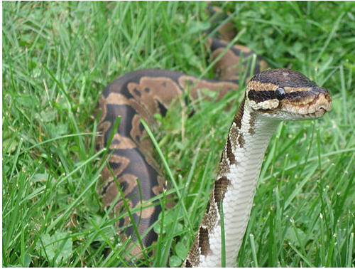
  

  

    <a href="./books/Python/Пориньте_у_Python_3.pdf">PDF</a>
    <a href="https://uk.wikibooks.org/wiki/%D0%9F%D0%BE%D1%80%D0%B8%D0%BD%D1%8C%D1%82%D0%B5_%D1%83_Python_3">Source</a>
  

       

  
<h1>JavaScrypt</h1>

  

    

    <h3>Рoзуміння ECMAScript 6</h3>
      

    
  

    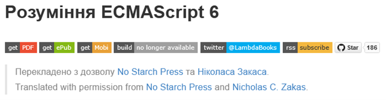
  

  

    <a href="./books/JS/Рoзуміння ECMAScript 6">PDF</a>
    <a href="https://understandinges6.denysdovhan.com/#">Source</a>
  

       

    

    <h3>Розплутаний ClojureScript</h3>
      

    
  

    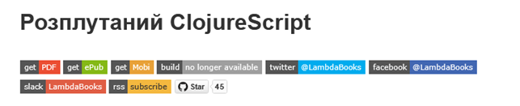
  

  

    <a href="./books/JS/ClojureScript">PDF</a>
    <a href="https://lambdabooks.github.io/clojurescript-unraveled/#">Source</a>
  

       

  
<h1>Хороші офіційні книги</h1>

    

    <h3>Томас Г. Кормен. Алгоритми доступно.</h3>
      

    
  

    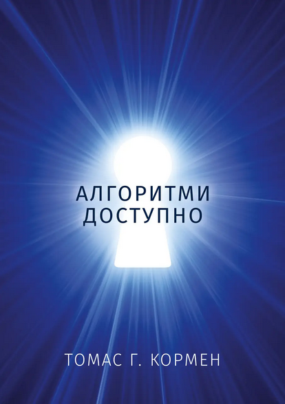
  

  

    <a href="https://kis.prom.ua/p1532783546-tomas-kormen-algoritmi.html">Source</a>
    <a href="https://www.google.com/search?client=firefox-b-d&q=%D0%A2%D0%BE%D0%BC%D0%B0%D1%81+%D0%93.+%D0%9A%D0%BE%D1%80%D0%BC%D0%B5%D0%BD.+%D0%90%D0%BB%D0%B3%D0%BE%D1%80%D0%B8%D1%82%D0%BC%D0%B8+%D0%B4%D0%BE%D1%81%D1%82%D1%83%D0%BF%D0%BD%D0%BE.">Mirror</a>
  

       

    

    <h3>Томас Г.Кормен, Чарлз Е.Лейзерсон, Роналд Л.Рівест, Кліфорд Стайн. Вступ до алгоритмів</h3>
      

    
  

    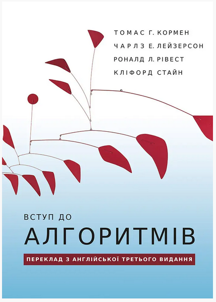
  

  

    <a href="https://kis.prom.ua/p1039323974-tomas-gkormen-charlz.html">Source</a>
    <a href="https://www.google.com/search?client=firefox-b-d&q=%D0%A2%D0%BE%D0%BC%D0%B0%D1%81+%D0%93.%D0%9A%D0%BE%D1%80%D0%BC%D0%B5%D0%BD%2C+%D0%A7%D0%B0%D1%80%D0%BB%D0%B7+%D0%95.%D0%9B%D0%B5%D0%B9%D0%B7%D0%B5%D1%80%D1%81%D0%BE%D0%BD%2C+%D0%A0%D0%BE%D0%BD%D0%B0%D0%BB%D0%B4+%D0%9B.%D0%A0%D1%96%D0%B2%D0%B5%D1%81%D1%82%2C+%D0%9A%D0%BB%D1%96%D1%84%D0%BE%D1%80%D0%B4+%D0%A1%D1%82%D0%B0%D0%B9%D0%BD.+%D0%92%D1%81%D1%82%D1%83%D0%BF+%D0%B4%D0%BE+%D0%B0%D0%BB%D0%B3%D0%BE%D1%80%D0%B8%D1%82%D0%BC%D1%96%D0%B2">Mirror</a>
  

       

    

    <h3>Як пасти котів Дж. Генк Рейнвотер</h3>
      

    
  

    
  

  

    <a href="https://fabulabook.com/info-yak-pasty-kotiv-15130">Source</a>
    <a href="https://www.google.com/search?client=firefox-b-d&q=%D0%AF%D0%BA+%D0%BF%D0%B0%D1%81%D1%82%D0%B8+%D0%BA%D0%BE%D1%82%D1%96%D0%B2+%D0%94%D0%B6.+%D0%93%D0%B5%D0%BD%D0%BA+%D0%A0%D0%B5%D0%B9%D0%BD%D0%B2%D0%BE%D1%82%D0%B5%D1%80">Mirror</a>
  

       

<h1>Source:</h1>
